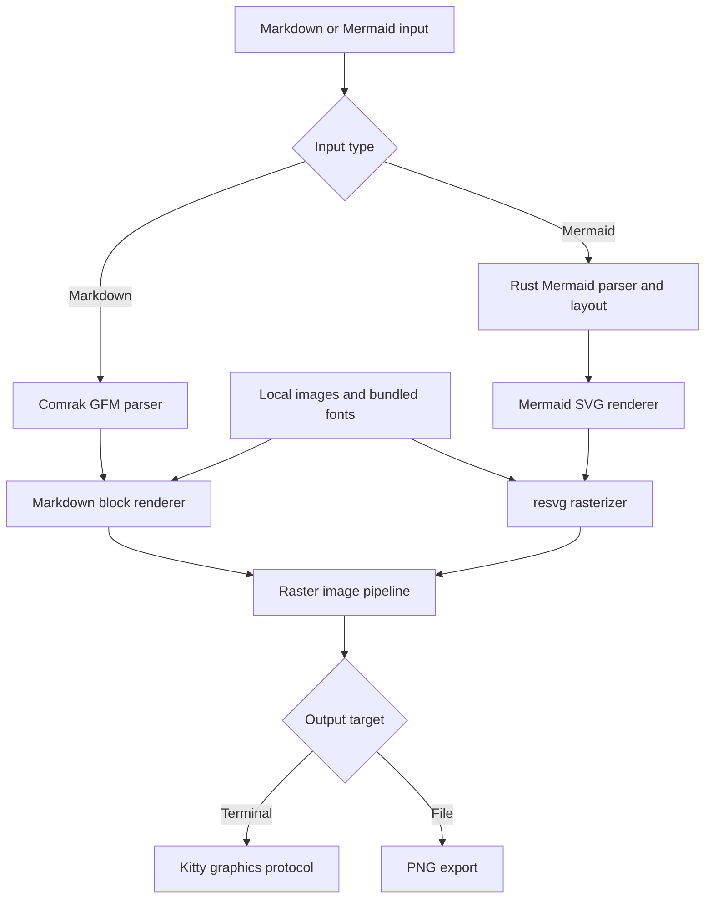

# kitmd

**Render Markdown and Mermaid diagrams directly in your terminal, with zero browser handoff and PNG output when you need a file.**

(Part of kit* series of graphic terminal apps:
[kitim](https://github.com/wensheng/kitim)
[kitmd](https://github.com/wensheng/kitmd)
[kitpdf](https://github.com/wensheng/kitpdf)
[kitdraw](https://github.com/wensheng/kitdraw)
[kitDOOM](https://github.com/wensheng/kitdoom))

(kitmd only runs on terminals that support Kitty Graphicas Protocol, such as: **Kitty**, **Ghostty**, **cmux**, **WezTerm**)

## Install

    cargo install kitmd

---

## Why kitmd Exists

- Stop bouncing between terminal, browser tabs, and screenshot tools just to preview a README or diagram.
- Stop guessing whether docs, diagrams, and embedded images actually look right from inside your terminal workflow.
- Stop paying the Node/browser startup tax for Mermaid diagrams that should render instantly.

---

<!-- ## Show, Don’t Tell


-->

## Key Capabilities

- **Terminal-native previews** for Markdown and Mermaid in Kitty-compatible terminals, so docs stay close to your code.
- **Extremely fast display** View your rendered markdown or mermaid in milliseconds.
- **Browser-free Mermaid rendering** powered by a Rust rendering pipeline instead of a headless browser.
- **One-command PNG export** for Markdown documents or Mermaid diagrams when you need to share, archive, or attach the result.

---

## How To Use

```bash
kitmd README.md
kitmd diagram.mmd --theme light --zoom 1.25
kitmd docs/architecture.md -o architecture.png
```

---

## How It Works



kitmd keeps the hot path local: Markdown is parsed with Comrak’s GFM extensions, Mermaid is parsed and laid out in Rust, local images and bundled fonts are resolved before rasterization, SVG is rasterized with resvg, and terminal output streams through the Kitty graphics protocol.

---

## CLI

```text
kitmd [--input-type auto|markdown|mermaid] [--width-cols N] [--theme dark|light] [--zoom RATIO] [--output FILE.png] <FILE|->
```

`--output` writes a PNG file and skips terminal rendering. Markdown exports as one tall PNG; Mermaid exports the rendered diagram PNG directly.
